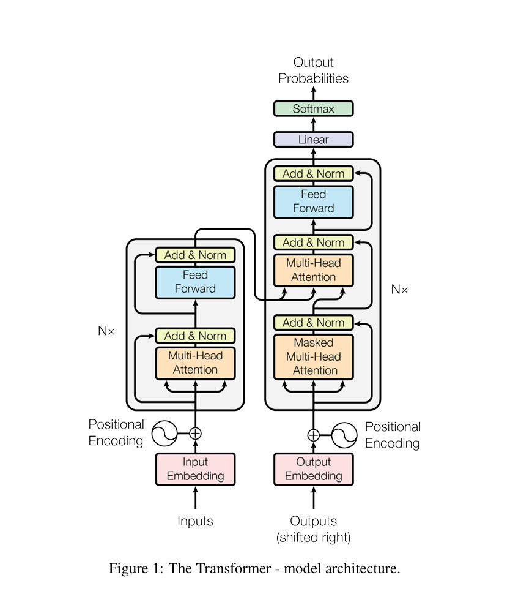
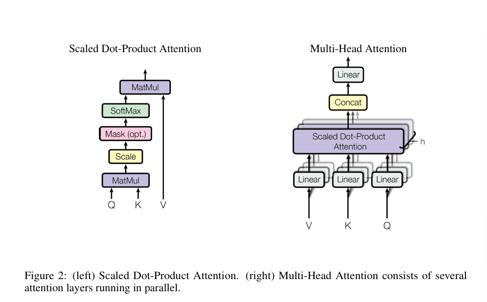
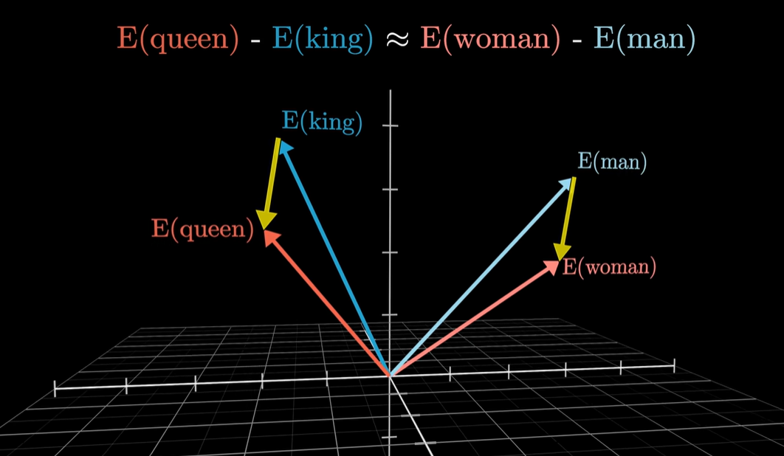
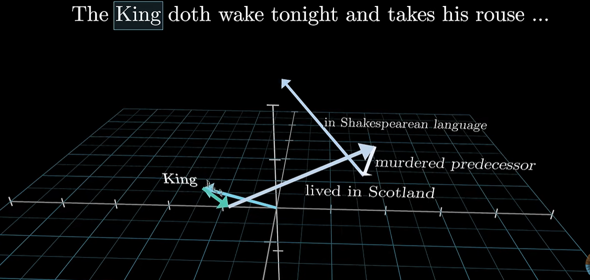
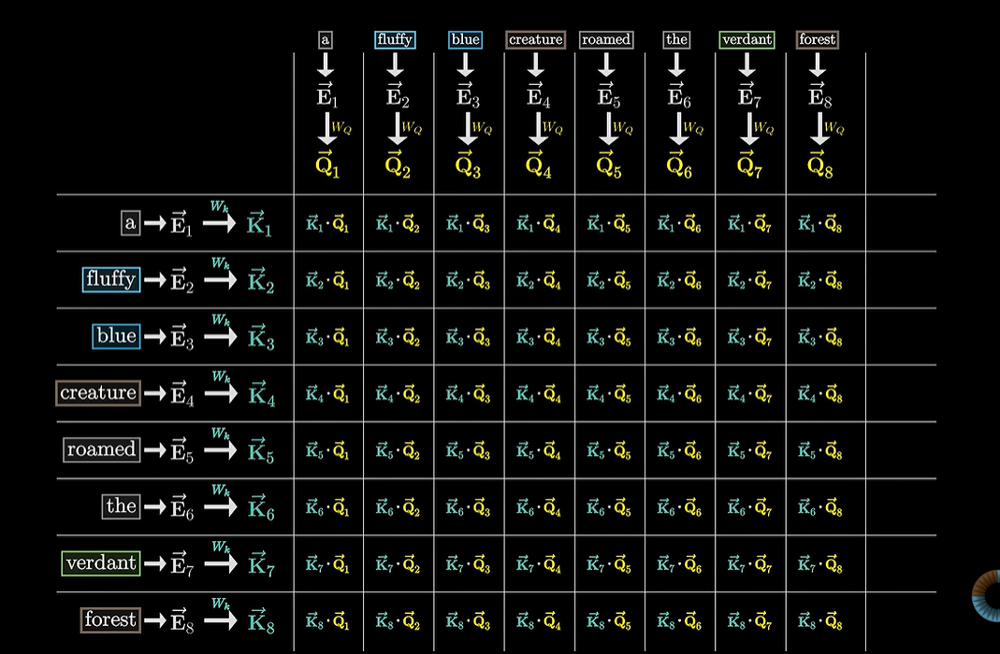
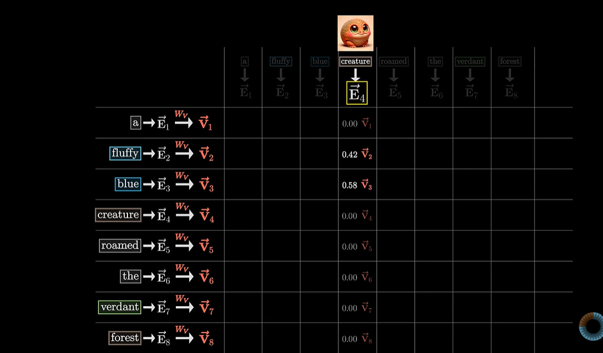
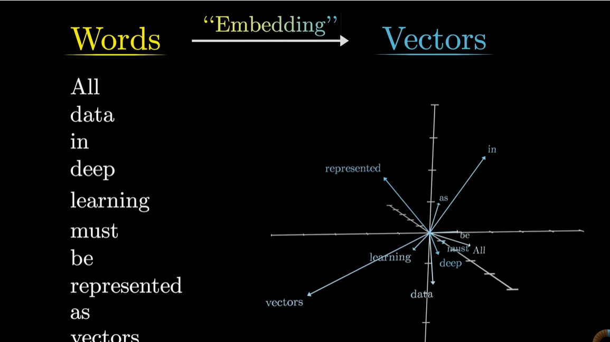
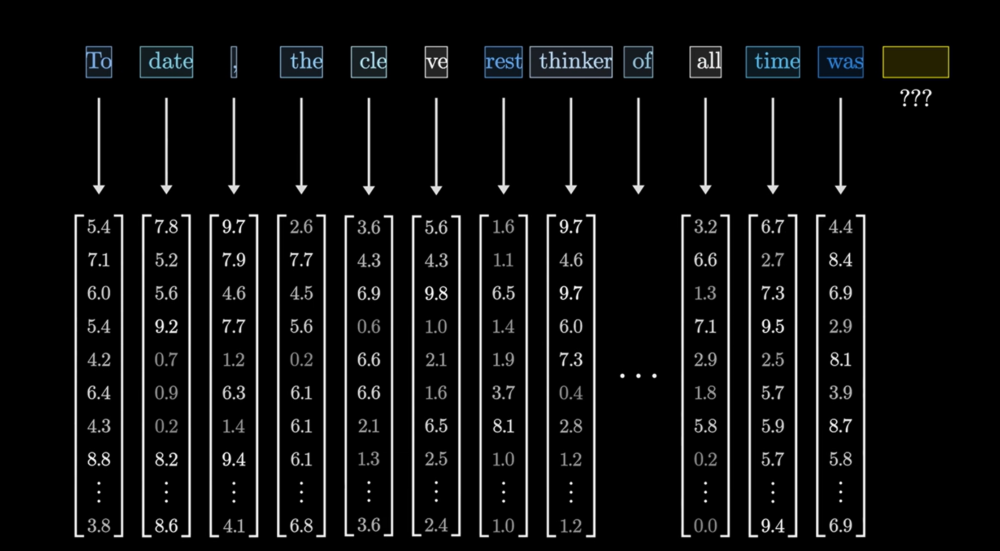

# Attention Is All You Need — 논문 정리

원 논문: Vaswani et al., 2017 (Google Brain / Google Research), NIPS 2017

---

## 0. 배경지식

### 이 논문 이전 상황
- 문장 처리(번역 등)의 표준은 **RNN(순환 신경망)**, 특히 그 개선판인 **LSTM, GRU**였음.
- RNN은 문장을 **한 단어씩 순서대로** 처리함: h_t = f(h_{t-1}, x_t)
  - h_t(은닉 상태) = "지금까지 읽은 내용의 요약"
  - h_t를 구하려면 반드시 h_{t-1}이 먼저 계산되어 있어야 함 → **순차 계산 강제**
- RNN의 문제점 2가지
  1. **병렬처리 불가**: 순서대로만 계산 가능해서 GPU의 "동시 계산" 능력을 못 씀 → 느림
  2. **장기 의존성 문제**: 문장이 길어지면 앞쪽 정보가 뒤로 갈수록 희미해짐 (전달 게임처럼 왜곡)
- **Attention**은 이미 존재했지만(2014~2015년경), 항상 **RNN의 보조 도구**로만 쓰였음 (RNN + Attention 조합)

### 이 논문의 핵심 주장
> "RNN을 완전히 버리고, Attention만으로 시퀀스를 처리하면 어떨까?"

이렇게 만든 것이 **Transformer**. RNN을 없앤 결과:
1. 순서대로 기다릴 필요 없어짐 → **병렬처리 가능 → 훨씬 빠름**
2. 문장 내 임의의 두 단어를 **직접 연결**해서 볼 수 있음 (장기 의존성 문제 해결)

### 딥러닝 계열 정리
- **딥러닝**(큰 범주) 안에 CNN, RNN, Transformer 등 여러 "구조(architecture)"가 있음
- **CNN**: 이미지 등 공간적 패턴 처리에 강함 (필터를 슬라이딩)
- **RNN**: 순서 있는 데이터(문장, 시계열) 처리, 순차 계산
- **Transformer**: RNN 없이 attention만으로 순서 있는 데이터를 병렬 처리

### Machine Learning에서 "Inference"의 의미
- 이 논문의 목적은 "논리적 추론 AI"가 아니라 **기계 번역(번역기)**
- ML에서 "inference(추론)"는 "**학습이 끝난 모델을 실제로 사용하는 단계**"를 뜻함 (학습=training의 반대말), 일상어의 "논리적 추론"과는 다른 의미

> **[유튜브 보충] 3Blue1Brown "But what is a GPT?" 강의 — 도입부**
> 강의는 GPT라는 이름 자체를 풀이하며 시작함: **G**enerative(생성형, 새 텍스트를 만들어냄) + **P**retrained(사전학습됨, "pre-"는 이후 특정 작업에 맞게 추가로 미세조정할 여지가 있음을 암시) + **T**ransformer(핵심, 특정 종류의 신경망 구조). Transformer는 오디오→자막, 텍스트→음성, 텍스트→이미지(DALL-E, 미드저니) 등 다양한 곳에 쓰이며, **원래는 2017년 구글이 "번역"용으로 개발**한 구조라고 소개함(=지금 읽고 있는 이 논문을 가리킴).
> ChatGPT류 모델의 핵심 동작 원리도 짚어줌: 모델은 그저 "다음에 올 토큰"에 대한 확률분포를 예측할 뿐인데, 이 예측 결과에서 하나를 무작위로 뽑아(샘플링) 문장 뒤에 붙이고, 늘어난 문장으로 다시 다음 토큰을 예측하는 과정을 반복하면 한 편의 글이 완성됨 — "다음 단어 맞히기"라는 단순한 목표가 어떻게 "글쓰기"라는 복잡한 능력으로 이어지는지 보여주는 설명.
> 딥러닝 자체에 대한 기초 설명도 포함: 머신러닝은 규칙을 사람이 직접 코드로 짜는 대신, 조절 가능한 파라미터(다이얼)를 가진 유연한 구조를 만들고 수많은 예시 데이터로 그 파라미터를 조금씩 조정하는 접근법. 가장 단순한 예로 "집 평수→집값을 예측하는 선형회귀"(파라미터 2개)를 들고, 이를 GPT-3(파라미터 1,750억 개)까지 확장한 것이 지금의 대규모 언어모델이라고 설명함. 공통 학습 알고리즘은 **역전파(backpropagation)**.

---

## 1. Abstract (초록)

- 기존 주류 모델: 인코더-디코더 구조를 가진 복잡한 RNN 또는 CNN 기반 (성능 좋은 모델은 추가로 attention까지 사용)
- 이 논문은 **attention 메커니즘에만 기반**한 새 구조 **Transformer**를 제안, RNN·CNN을 완전히 배제
- 두 기계번역 작업에서 품질 우수 + 병렬화 용이 + 학습시간 대폭 단축
- **WMT 2014 영→독**: 28.4 BLEU (기존 최고 기록, 앙상블 포함 대비 +2 이상) — 단일 모델로 앙상블들을 능가
- **WMT 2014 영→프랑스어**: 41.8 BLEU, GPU 8개로 3.5일 학습 (기존 최고 모델 대비 학습비용 훨씬 적음)
- **영어 구문 분석(constituency parsing)**에도 성공적으로 적용 → 번역 외 작업에도 잘 일반화됨을 입증

### 용어
- **BLEU**: 번역 품질 점수 (사람 번역과의 유사도, 높을수록 좋음)
- **WMT**: Workshop on Machine Translation, 번역 모델 성능을 겨루는 공식 데이터셋/대회
- **ensemble(앙상블)**: 여러 모델을 합쳐 성능을 높이는 기법. Transformer는 단일 모델로 앙상블들을 능가함
- **state-of-the-art (SOTA)**: 현재까지 나온 것 중 최고 성능
- **constituency parsing(구문 분석)**: 문장을 문법 구조(명사구, 동사구 등)로 쪼개 나무(tree) 형태로 분석하는 작업. 번역과 전혀 다른 성격의 작업이라, 여기서도 잘 되면 "Transformer가 범용적으로 강력하다"는 증거가 됨

---

## 2. Introduction (서론)

1. RNN(LSTM/GRU)이 언어 모델링, 번역 등에서 최고 수준 기법으로 자리잡아 왔음
2. RNN은 위치를 따라 순차적으로 계산(h_t는 h_{t-1}에 의존) → 학습 샘플 내부에서 병렬화 불가능, 문장이 길수록 심각해짐. 메모리 제약으로 배치 처리(여러 문장 묶어 처리)도 제한됨
3. 속도 개선 시도(factorization tricks, conditional computation)는 있었지만 "순차 계산"이라는 근본 제약은 해결 못함
4. Attention은 거리에 상관없이 의존관계를 모델링할 수 있어 유용했지만, 극소수 예외를 빼면 항상 RNN과 함께 사용됨
5. → 이 논문은 RNN을 완전히 버리고 attention만으로 입력-출력 간 전역적(global) 의존관계를 모델링하는 **Transformer** 제안
6. 결과: 병렬화 크게 향상, P100 GPU 8개로 단 12시간 학습만으로 SOTA 번역 품질 달성

> **[유튜브 보충] "왜 attention이 성공했나"에 대한 강의의 마무리 언급**
> 강의는 attention 챕터를 마무리하며 이렇게 짚음: attention이 성공한 이유가 특정 하나의 "똑똑한 동작" 때문이라기보다, **엄청나게 병렬화(parallelizable)가 가능하다**는 점이 크다고 설명함 — GPU로 짧은 시간에 방대한 계산을 돌릴 수 있어서, "모델과 데이터 규모를 키우면 성능이 따라온다"는 딥러닝의 경험칙과 잘 맞아떨어진다는 것. 이는 논문 Introduction에서 강조하는 핵심 동기(RNN의 순차 계산이 병렬화를 막아왔고, Transformer가 이를 해결했다는 점)와 정확히 같은 지점을 가리킴 — 다만 논문은 이를 "번역 품질과 학습 속도"의 언어로, 강의는 "왜 GPT 같은 초대형 모델이 가능해졌는가"의 언어로 설명한다는 차이가 있음.

---

## 3. Background (배경)

- CNN 기반 시도들(Extended Neural GPU, ByteNet, ConvS2S)도 순차 계산 문제를 풀려고 했음: 모든 위치를 병렬로 계산 가능
- 하지만 CNN은 멀리 떨어진 두 위치를 연결하려면 필요한 연산 수가 거리에 비례해 증가(ConvS2S는 선형적, ByteNet은 로그적) → 장거리 의존관계 학습이 어려움
- **Transformer**는 이를 **상수(constant) 개의 연산**으로 줄임 — 거리와 무관하게 항상 한 번의 연산으로 연결 가능
  - 단, attention 가중치로 평균을 내다 보니 유효 해상도(정보의 세밀함)가 줄어드는 부작용 있음 → **Multi-Head Attention**으로 상쇄(뒤에서 설명)

### Self-attention(intra-attention) 정의
> **하나의 시퀀스 내부**에서 서로 다른 위치들을 연관시켜, 그 시퀀스의 표현을 계산하는 attention 메커니즘

- 일반 attention: 서로 다른 두 시퀀스 사이의 관계를 봄 (예: 디코더 문장 ↔ 인코더 문장)
- Self-attention: **같은 문장 안**에서 단어들끼리 관계를 봄 (예: "it"이 문장 내 어떤 단어를 가리키는지 스스로 판단)
- Self-attention 자체는 이미 독해, 요약, 텍스트 함의 등에서 쓰이고 있었음 — 이 논문이 처음 발명한 개념은 아님
- 하지만 **RNN도 CNN도 전혀 쓰지 않고 오직 self-attention만으로 인코더-디코더 전체를 구성한 것은 이 논문이 최초**라고 주장

---

## 4. Model Architecture (모델 구조)

### 인코더-디코더 기본 구조
- **인코더**: 입력 시퀀스 (x1,...,xn) → 연속적인 표현 z=(z1,...,zn)으로 변환 (입력 개수 n = 출력 개수 n, 1대1 대응)
- **디코더**: z가 주어지면 출력 시퀀스 (y1,...,ym)을 **한 번에 하나씩** 생성 (m은 n과 다를 수 있음)
- **Auto-regressive(자기회귀적)**: 디코더는 각 단계에서, **이전에 자신이 생성한 심볼들을 다시 입력으로 사용**하며 다음 것을 생성함
  - 예: "나는" 생성 → [나는]을 보고 "너를" 생성 → [나는, 너를]을 보고 "사랑해" 생성
  - Figure 1에서 "Outputs"가 다시 "Output Embedding"으로 들어가는 화살표가 이걸 표현함
  - **"shifted right(오른쪽으로 밀림)"**: 학습 시 디코더에 주는 입력을 한 칸 밀어서(target 문장 그대로가 아니라 한 칸 앞선 것을) 넣어줌 → auto-regressive 구조를 정확히 재현하기 위함

### 전체 구조 (Figure 1)
- Transformer도 인코더-디코더 틀을 따름
- 인코더(왼쪽): Input Embedding + Positional Encoding → [Multi-Head Attention → Add&Norm → Feed Forward → Add&Norm]을 N번 반복
- 디코더(오른쪽): Output Embedding + Positional Encoding → [Masked Multi-Head Attention → Add&Norm → Multi-Head Attention(인코더 결과 참고) → Add&Norm → Feed Forward → Add&Norm]을 N번 반복 → Linear → Softmax → 출력 확률

### Figure 1·Figure 2 박스별 설명

*Figure 1 — Transformer 전체 구조 (Vaswani et al., 2017). 왼쪽이 인코더, 오른쪽이 디코더.*

*Figure 2 — (왼쪽) Scaled Dot-Product Attention 내부 계산 순서. (오른쪽) Multi-Head Attention 구조 (Vaswani et al., 2017).*

**Figure 1의 각 박스가 뜻하는 것 (아래에서 위로)**

| 박스 이름 | 의미 |
|---|---|
| Input / Output Embedding | 단어(토큰)를 512차원 벡터로 바꾸는 학습된 대응표 |
| Positional Encoding (⊕로 표시) | 사인·코사인으로 만든 위치 벡터를 임베딩에 더함(순서 정보 주입) |
| Multi-Head Attention | Q,K,V를 8개로 나눠 병렬로 attention 계산 후 합치는 층 (본문 3.2.2, 수식은 아래 Figure 2 참고) |
| Masked Multi-Head Attention | 디코더의 self-attention. 미래 위치를 −∞ 처리해서 가리는 규칙이 추가된 것 |
| (디코더 중간의) Multi-Head Attention | encoder-decoder attention. Query는 디코더에서, Key·Value는 인코더 출력에서 옴 |
| Add & Norm | 잔차연결(입력을 출력에 더함, Add) + 층 정규화(Norm)를 합친 것. 수식: LayerNorm(x + Sublayer(x)) |
| Feed Forward | Position-wise Feed-Forward Network (본문 3.3). 512→2048→512로 확장·압축, 중간에 ReLU |
| Linear → Softmax | 디코더 최종 출력을 어휘집 크기만큼 늘린 뒤(Linear), 다음 토큰 확률로 변환(Softmax) |
| Nx (N번 반복 표시) | 이 블록 전체(각 sub-layer들의 묶음)를 인코더·디코더 각각 6번(N=6)씩 쌓았다는 표시 |

**Figure 2 — Attention 내부를 확대한 그림**

*왼쪽: Scaled Dot-Product Attention (아래에서 위로)*

| 박스 | 의미 |
|---|---|
| Q, K, V (맨 아래 입력) | Query, Key, Value 벡터(행렬) |
| MatMul (1번째) | Q와 K를 곱함 (QK^T) → 모든 단어 쌍의 관련성 원본 점수표 생성 |
| Scale | 그 점수표를 √d_k로 나눔 (softmax가 한쪽으로 쏠려 학습이 멈추는 걸 방지) |
| Mask (opt.) | 필요한 경우(디코더 self-attention)만, 허용 안 되는 위치의 점수를 −∞로 바꿈. 인코더·encoder-decoder attention에서는 사용 안 함(optional) |
| SoftMax | 점수를 "합이 1이 되는 가중치(비율)"로 변환 |
| MatMul (2번째) | 그 가중치와 V를 곱함 → 최종 output (가중합) |

*오른쪽: Multi-Head Attention (아래에서 위로)*

| 박스 | 의미 |
|---|---|
| V, K, Q (맨 아래 입력) | 원본 Value, Key, Query 벡터(512차원) |
| Linear (3개, V·K·Q 각각) | 각각 h개(=8개)의 서로 다른 학습된 행렬(W_i^V, W_i^K, W_i^Q)을 곱해 64차원으로 투영 |
| Scaled Dot-Product Attention (h개, 병렬로 쌓여 그려짐) | 왼쪽 그림의 계산을 8번(각 head마다) 동시에 병렬 수행 |
| Concat | 8개 head의 결과(각 64차원)를 이어붙여 다시 512차원으로 만듦 |
| Linear (맨 위) | 이어붙인 결과에 W^O를 곱해 최종 Multi-Head Attention 결과를 만듦 |

### 참고 — 이 박스들이 실제 "신경망(노드-커넥션)"에서는 무엇인지

전통적으로 신경망은 동그라미(노드)와 그걸 잇는 선(커넥션, 가중치)으로 그려지는데, Figure 1·2의 "박스"는 이 노드-선 구조를 압축해서 그린 것에 대응됨:

- **"512차원 벡터"** = 사실 512개의 노드가 한 층에 늘어선 것과 같음
- **"W^Q, W^K, W^V, W1, W2 같은 행렬을 곱하는 것"** = 두 층(노드 집합) 사이를 잇는 선들의 가중치 전체(완전연결)에 해당. 예: 512개 노드 → 64개 노드로 가는 W^Q는 512×64=32,768개의 선(가중치)
- **Add & Norm** = 특정 노드값들을 더하고 정규화하는 연산 규칙 (선이라기보다는 노드값에 적용되는 후처리)
- 노드가 워낙 많아(512개, Feed Forward 중간은 2048개) 일일이 동그라미로 그리면 알아볼 수 없으므로, "512개 노드 뭉치"를 박스 하나로 뭉뚱그려 그리고 세부 계산은 수식으로 설명하는 방식을 씀

### 3.1 인코더와 디코더 스택

**인코더**
- N=6개의 동일한 층을 쌓음 (구조는 같지만 층마다 학습되는 가중치 값은 다름)
- 각 층은 2개의 sub-layer: ① Multi-head self-attention ② Position-wise feed-forward network
- 각 sub-layer 주위에 **residual connection(잔차 연결) + layer normalization** 적용
  - 수식: **LayerNorm(x + Sublayer(x))**
  - Figure 1의 "Add & Norm" 박스가 이것: 먼저 더하고(Add=잔차연결), 그 다음 정규화(Norm)
  - **잔차 연결**: 원본 입력(x)을 sublayer 통과 결과에 다시 더해줌 → 깊은 층을 쌓아도 정보가 잘 보존되고 학습이 안정됨 (ResNet에서 가져온 아이디어)
  - **layer normalization**: 값의 크기를 일정 범위로 정돈해 학습 안정화
  - 잔차 연결이 성립하려면 x와 Sublayer(x)의 차원이 같아야 함 → 그래서 모델 전체가 **d_model=512** 차원으로 통일됨

**디코더**
- 마찬가지로 N=6개 층
- 각 층은 **총 3개의 sub-layer**로 구성됨: 인코더에 있던 2개(① self-attention, ③ feed-forward — 단, ①은 masking이 추가된 형태)에 더해, 그 사이에 **② encoder-decoder attention이라는 새로운 sub-layer 하나가 추가**됨
  1. **Masked Multi-Head Self-Attention** (인코더의 self-attention과 같은 종류지만, masking이 추가된 버전)
  2. **Multi-Head Attention (encoder-decoder attention)** — 여기가 디코더에만 있는, 새로 추가된 부분. 인코더 출력에 대해 attention 수행
  3. **Feed-Forward** (인코더와 동일한 종류)
- 각 sub-layer마다 Add&Norm 적용 (총 3번)
- **Masking**: 디코더의 self-attention(위 1번)은 "그 위치 이후(미래)의 위치를 보지 못하게" 수정됨
  - 이유(auto-regressive 속성 보존): 학습 시 정답 문장 전체가 이미 주어져 있지만, self-attention 구조상 모든 위치를 자유롭게 볼 수 있어서 masking 없이는 미래 정답을 그대로 "커닝"해버릴 위험이 있음(data leakage) → 실전(inference)에서는 미래 단어가 아직 존재하지 않으므로, 학습 때도 똑같은 조건을 강제해야 진짜 번역 능력을 기름
  - 위치 i의 예측은 오직 i보다 작은(그리고 i를 포함한) 위치들에만 의존하도록 보장

### 3.2 Attention

**일반 정의**: attention 함수는 하나의 query와 여러 key-value 쌍을 하나의 output으로 매핑. query, key, value, output은 모두 벡터.
- output은 value들의 **가중합(weighted sum)**으로 계산되고, 각 value의 가중치는 query와 해당 key의 **호환성 함수(compatibility function)**로 계산됨
- **왜 Q, K, V로 3개나 나누는가**: 하나의 벡터가 "질문(Q)", "내가 제공 가능한 것(K)", "실제 내용물(V)"이라는 서로 다른 역할을 동시에 잘 해내기는 어려움. 세 역할을 각각 별도의 학습된 투영(W^Q, W^K, W^V)으로 분리해야, 모델이 "무엇을 찾을지"와 "무엇을 줄지"와 "실제로 전달할 정보"를 독립적으로 최적화할 수 있음

**비유(유튜브 검색)**: Query=검색어, Key=영상 제목/태그, Value=영상 콘텐츠 자체. 검색어와 태그를 비교해 관련성 점수를 매기고, 그 점수(가중치)만큼 각 영상 콘텐츠를 섞어서 최종 결과를 만듦

> **[유튜브 보충] 3Blue1Brown "Attention in Transformers" 강의 — 공간적 비유**
> 임베딩 벡터는 아주 고차원 공간(예: GPT-3는 12,288차원)의 "좌표"라고 생각할 수 있음. 처음엔 각 단어 벡터가 문맥 없이 그 단어 하나의 뜻만 담고 있다가, attention 블록을 거치면서 점점 구체적인 문맥이 반영된 위치로 이동함. 즉 attention을 "이 벡터를 공간 안에서 더 정확한 의미 쪽으로 옮겨주는 과정"으로 이해하면 직관적임.
> Query·Key의 역할을 사람 말로 풀면: **Query = "나는 지금 뭘 찾고 있어?"**, **Key = "나는 이런 걸 줄 수 있어"**. 이 둘의 내적이 크면(방향이 잘 맞으면) 그 Key를 가진 단어가 그 Query를 가진 단어에게 강하게 "관련 있다"고 판단됨.
> **임베딩 공간이 "의미"를 방향으로 담는다는 고전적인 예시**: word2vec류 임베딩에서 자주 인용되는 예로, E(queen) − E(king) ≈ E(woman) − E(man) 이라는 벡터 관계가 성립함 — "왕→여왕"으로 가는 방향과 "남자→여자"로 가는 방향이 임베딩 공간에서 거의 같다는 뜻. 이는 임베딩 공간의 각 방향(축)이 "성별", "신분" 같은 특정한 의미 성분을 담고 있을 수 있음을 보여주는 유명한 예시.

*강의에 나온 원본 예시: "왕→여왕"으로 가는 방향과 "남자→여자"로 가는 방향이 임베딩 공간에서 거의 같은 벡터로 나타남을 3차원으로 시각화한 그림.*
> **문맥에 따라 벡터가 이동하는 예시**: "The King doth wake tonight..."라는 (셰익스피어풍) 문장에서, "King"이라는 단어의 벡터가 attention을 거치며 주변 단서들 — "셰익스피어 어투다", "전왕을 죽이고 즉위했다", "스코틀랜드에 산다"(맥베스를 연상시키는 단서들) — 만큼 원래 위치에서 조금씩 이동해서, 문맥이 반영된 훨씬 구체적인 의미의 벡터로 바뀜. 이게 바로 attention 한 블록이 하는 일 전체를 압축한 그림.

*강의 원본 예시: "The King doth wake tonight..."라는 셰익스피어풍 문장에서, "in Shakespearean language", "murdered predecessor", "lived in Scotland" 같은 단서들이 "King" 벡터를 원래 위치에서 조금씩 밀어내며 구체적인 의미로 이동시키는 과정을 화살표로 시각화한 그림.*

#### 3.2.1 Scaled Dot-Product Attention

- 입력: 차원 d_k인 query·key들, 차원 d_v인 value들
- 계산: query와 모든 key의 **내적(dot product)** 계산 → **√d_k로 나눔(scale)** → **softmax** 적용 → 가중치 획득

**수식 (1)**:
$$\text{Attention}(Q,K,V) = \text{softmax}\left(\frac{QK^T}{\sqrt{d_k}}\right)V$$

- 실제로는 여러 단어의 Q, K, V를 각각 하나의 **행렬**로 묶어서 한꺼번에 계산 (단어 하나씩 따로 계산하면 느림 → 행렬로 묶으면 GPU가 한 번의 행렬곱으로 모든 단어 쌍을 동시에 계산 가능 = 병렬처리의 실제 구현)
- QK^T: 모든 단어 쌍의 내적(관련성 원본 점수)을 담은 n×n 표
- **√d_k로 나누는 이유(scaling)**: d_k(차원)가 커질수록 내적값 자체가 커지는 경향이 있음 → 값이 너무 크면 softmax가 한쪽으로 극단적으로 쏠려버림(예: [0.99998, 0.00002, 0])→ 이렇게 쏠리면 입력을 바꿔도 출력이 거의 안 바뀌는 상태가 됨(기울기 gradient ≈ 0) → 학습이 사실상 멈춤. 이를 방지하기 위해 미리 값을 적당히 눌러줌(scale down)

**Additive attention vs Dot-product attention**
- **Additive attention**: query와 key를 은닉층 1개짜리 feed-forward network에 통과시켜 호환성 점수를 계산 (학습 가능한 작은 신경망 방식)
- **Dot-product attention**: 그냥 내적(곱셈) — 순수 행렬곱이라 GPU에서 훨씬 빠르고 메모리 효율적
- d_k가 작을 때는 두 방식 성능 비슷하지만, d_k가 크고 스케일링이 없으면 additive가 더 나음 → 그래서 Transformer는 dot-product를 쓰되 스케일링(1/√d_k)을 추가함

> **[유튜브 보충] QK^T 행렬을 "격자(grid)"로 보는 관점**
> 강의에서는 QK^T(softmax 이전 단계)를 **"모든 단어 쌍의 관련도를 담은 n×n 격자"**로 설명함. 각 칸의 값은 (그 열의 단어가 갖는 Query)·(그 행의 단어가 갖는 Key)의 내적.
> 이 격자를 **"attention pattern(어텐션 패턴)"**이라 부르는데, 소프트맥스를 **열(column) 단위로** 적용해 각 열이 합 1인 확률분포가 되게 만듦 → "이 단어가 다른 단어들에게 주목하는 비율"이 하나의 열에 나타남.
> 강의는 이 표를 **"관심도 분배표"**에 비유함: 한 단어가 "지금 누구 말을 얼마나 귀 기울여 들어야 하지?"를 정하는 표.

*강의 원본 예시: 8단어 문장("a fluffy blue creature roamed the verdant forest")의 각 단어별 Query·Key를 만들고, 모든 조합의 내적(K·Q)을 표로 나열한 것. 아직 마스킹도 softmax도 적용하지 않은 원본 점수 상태.*

> **마스킹 적용 예시**: masking 전(unnormalized) 표에는 −∞로 채워진 칸들이 있는데, 이는 "이후 단어"에 해당하는 칸들 — 이전 단어들은 실수 값이 채워지고, 이후 단어들은 전부 −∞로 채워진, 정확히 "하삼각형(lower-triangular)" 모양이 됨. 이 표에 softmax를 (열 단위로) 적용하면, −∞였던 칸은 정확히 0.00이 되고, 나머지 칸들은 그 열 안에서 합이 1이 되는 값으로 재배분됨.

*(참고: 이 부분은 QK 격자 위에 masking(−∞)과 softmax를 적용한 이후 버전에 해당함 — 강의 캡처 중 해당 프레임이 있으면 여기에 삽입. 없으면 위 QK 격자 이미지에 이어지는 개념으로, 텍스트 설명만으로 이해해도 무방함.)*

> **Value 가중합 예시**: 강의의 "a fluffy blue creature..." 예문에서, "creature"의 attention pattern 가중치가 fluffy=0.42, blue=0.58(나머지는 거의 0)이었다면, 최종적으로 더해지는 변화량은 **0.42×(fluffy의 Value 벡터) + 0.58×(blue의 Value 벡터)**로 계산됨. 이렇게 "형용사들의 의미를 실어 나르는 Value"가 가중치대로 섞여서 명사의 벡터를 더 구체적으로 만들어주는 것.

*강의 원본 예시: "creature"의 새 벡터(V₄)가 attention 가중치대로 "fluffy"의 Value(0.42)와 "blue"의 Value(0.58)를 섞어서 만들어지는 과정을 표로 보여줌 (나머지 단어들의 가중치는 0.00).*

> 이렇게 구해진 비율(가중치)은 그 자체로 최종 결과가 아니라, 각 단어의 **Value 벡터**를 얼마나 섞을지 정하는 데 쓰임 — 이게 수식 (1)에서 마지막에 V를 곱하는 부분에 해당. 참고로 Value 벡터는 Query·Key·attention pattern과는 **완전히 독립적으로**, 원본 임베딩에 W_V를 곱해서 별도로 미리 만들어짐(Q,K로 "패턴"을 정하는 계산과, V를 만드는 계산은 서로 다른 두 갈래로 동시에 진행되고, 마지막에 합쳐짐).

#### 3.2.2 Multi-Head Attention

- d_model 차원 그대로 attention을 1번 하는 대신, Q/K/V를 **h개의 서로 다른, 학습된 선형 투영(linear projection)**으로 각각 d_k, d_k, d_v 차원으로 변환해서, attention을 h번 병렬로 수행
- **선형 투영이란**: 원본 벡터에 학습 가능한 행렬 W를 곱해 다른 차원의 새 벡터를 만드는 것. W 자체는 "변환 도구"이고, 원본 벡터에 실제로 곱해야(Q×W_i^Q) 비로소 투영된 결과가 나옴
- h개의 결과(head)를 **concat(이어붙이기)**한 후, 다시 한번 선형 투영(W^O)해서 최종 결과

**수식**:
$$\text{MultiHead}(Q,K,V) = \text{Concat}(\text{head}_1,...,\text{head}_h)W^O$$
$$\text{head}_i = \text{Attention}(QW_i^Q, KW_i^K, VW_i^V)$$

- **왜 여러 개(h개)를 쓰는가**: 하나의 attention만 쓰면, 문장 안의 여러 종류의 관계(문법 관계, 지시 관계, 의미 관계 등)를 전부 "평균"으로 뭉개버림. 여러 head를 두면 각 head가 서로 다른 관점(representation subspace)을 담당할 수 있어, 평균화로 정보가 흐려지는 문제를 해결

> **[유튜브 보충] "헤드 = 각자 다른 질문만 담당하는 전문가" 비유와 구체적 예시**
> 강의는 헤드 하나(Q,K,V 한 세트로 이루어진 완결된 절차 전체)를 "**특정 질문 하나만 던지는 전문가**"에 비유함: 예를 들어 전문가 A(헤드 1)는 "내 앞에 형용사가 있는가?"만 담당하고, 전문가 B(헤드 2)는 "내가 인물 이름인데 주변에 왕족 관련 단어가 있는가?"만 담당하는 식. 문맥이 단어의 의미를 바꾸는 방식이 한 가지가 아니기 때문에, 헤드 하나로는 한 종류의 패턴밖에 학습하지 못하고, 여러 헤드가 있어야 이 다양한 관계를 동시에 포착할 수 있다는 논리.
> 구체적 예시: "Harry"라는 단어 근처에 "wizard(마법사)"가 있으면 해리 포터를 가리키도록, 반대로 "Queen, Sussex, William"이 같이 나오면 (영국) 왕자를 가리키도록 임베딩이 업데이트될 수 있음. 또 "they crashed the car"라는 문장에서는 "crashed"라는 동사가 "car"의 의미(형태가 손상된 자동차)에 영향을 줌. 강의는 실제로는 이런 패턴들이 사람이 해석하기 쉬운 형태로 나오지 않고, 모델이 "다음 토큰 예측"이라는 목표를 최적화하는 과정에서 저절로(암묵적으로) 학습된다고 덧붙임.
> **용어 관련 참고**: 강의는 실제 논문·구현에서는 각 헤드의 Value-Up 행렬들을 전부 이어붙여 하나의 큰 **출력 행렬(output matrix)**로 표기하는 경우가 많고(=논문의 W^O에 해당), 사람들이 그냥 "Value 행렬"이라 부를 때는 보통 Value-Down 단계만 가리키는 경우가 많다고 설명함 — 다른 자료를 읽을 때 헷갈리지 않도록 참고할 만한 표기 관례.
- 이 논문에서는 **h=8**, d_k=d_v=d_model/h=**64**
- 각 head의 차원이 줄어든 덕분에, 전체 계산 비용은 d_model 전체를 쓰는 단일 head attention과 비슷함 (같은 비용으로 다양한 관점을 얻는 셈)

> **[유튜브 보충] GPT-3 규모에서의 Multi-Head — 96개 헤드 + Value의 저랭크(low-rank) 분해**
> 강의(3Blue1Brown)는 GPT-3를 예로 듦: 블록 하나당 **96개의 attention head**가 병렬로 돎. 각 헤드가 각자 자기만의 Q·K·V 행렬로 독립적인 attention pattern과 "이 임베딩에 더할 변화 제안(Δe)"을 만들고, 위치마다 이 96개의 제안을 **전부 더해서** 최종 업데이트를 만듦 — 논문의 Concat+W^O와 본질적으로 같은 "여러 관점을 합치는" 아이디어.
> **Value 행렬의 효율화**: Value 행렬을 임베딩 차원×임베딩 차원(예: 12,288×12,288)짜리 정사각 행렬로 그대로 두면 헤드 하나당 파라미터가 폭발적으로 늘어남(GPT-3 기준 약 1.5억 개). 그래서 실제 구현에서는 Value 행렬을 **두 개의 작은 행렬(Value-Down: 큰 임베딩 공간→작은 key-query 공간, Value-Up: 작은 공간→다시 큰 임베딩 공간)의 곱**으로 쪼갬. 선형대수 용어로는 Value 변환을 **저랭크(low-rank) 변환**으로 제약하는 것. 이렇게 하면 Q, K, Value-Down, Value-Up 네 행렬이 비슷한 크기가 되어, 헤드 하나당 파라미터가 훨씬 절약됨(GPT-3 기준 헤드당 약 630만 개). 논문의 W_i^Q, W_i^K, W_i^V, W^O 네 종류 투영 행렬이 대략 이런 "작은 차원으로 압축 후 다시 확장"하는 구조와 같은 맥락.
> **참고**: 강의는 지금까지 설명한 게 **self-attention**이고, 서로 다른 두 데이터셋(예: 번역 시 원문 언어 vs 번역 중인 언어)을 다루는 변형을 **cross-attention**이라 부른다고 설명함(키/쿼리가 서로 다른 데이터에서 나오고 보통 masking 미적용) — 이는 논문 3.2.3절의 "encoder-decoder attention"과 대응되는 개념.

#### 3.2.3 Attention이 쓰이는 3가지 방식

| 위치 | Query 출처 | Key/Value 출처 | Masking |
|---|---|---|---|
| ① Encoder-decoder attention (디코더 안) | 이전 디코더 층 | **인코더**의 출력 | 없음 (입력 전체를 다 봄) |
| ② Encoder self-attention | 이전 인코더 층 | 이전 인코더 층 (Q,K,V 모두 동일 출처) | 없음 |
| ③ Decoder self-attention | 이전 디코더 층 | 이전 디코더 층 (Q,K,V 모두 동일 출처) | **있음** (미래 위치는 −∞ 처리) |

- **①**: 디코더가 "질문"하고 인코더가 저장해둔 정보(memory)에서 "답을 찾아오는" 구조. 디코더의 모든 위치가 입력 시퀀스 전체를 참조 가능
- **②**: 인코더의 각 위치는 인코더의 모든 위치를 자유롭게 참조 가능 (masking 없음, 문장 전체를 이미 다 알아도 문제없기 때문)
- **③**: "leftward information flow(미래→과거로의 정보 흐름)"을 막아 auto-regressive 속성 보존. 구현은 QK^T 계산 결과 표에서, 허용 안 되는(illegal) 위치 쌍의 점수를 **−∞로 설정** → softmax를 거치면 e^(−∞)=0이 되어 해당 위치의 가중치가 정확히 0이 됨 (Figure 2의 "Mask (opt.)" 박스가 이 역할)

**왜 ①(encoder-decoder attention)에는 masking이 없고 ③(decoder self-attention)에만 있는가**: masking의 목적은 "아직 만들어지지 않은 예측 대상(target)의 미래를 미리 보는 것"을 막는 것. ③은 Query·Key·Value가 전부 target(디코더 자신, 즉 정답 문장)이라 미래 위치가 "아직 예측 안 한 정답 그 자체"라서 가려야 함(안 가리면 정답을 그대로 베끼는 지름길이 생겨 실전에서 무용지물이 됨). 반면 ①은 Key·Value가 source(인코더, 원본 문장)인데, 원본 문장은 학습·실전 모두에서 이미 통째로 주어진 정보라 "미래를 미리 본다"는 개념 자체가 성립하지 않음 — 그래서 가릴 필요가 없고, 오히려 전체를 다 참고하는 게 의도된 설계.

**왜 인코더 K/V를 디코더가 참고해야 하는가(=① encoder-decoder attention이 필요한 이유)**: 디코더의 self-attention(③)만 있으면 "지금까지 내가 쓴 글이 문법적으로 말이 되는가"만 챙길 수 있을 뿐, 입력(원문)의 실제 의미와 무관하게 그럴듯한 문장만 만들어내는 상태가 됨. Encoder-decoder attention이 있어야 매 단어를 만들 때마다 "원문의 어느 부분에 해당하는 내용을 지금 만들고 있는지"를 확인하며 생성 가능 — 입력과 출력을 실제로 이어주는 연결 고리. 이 구조는 번역이 아닌 다른 시퀀스 변환 작업(구문 분석, 요약, 음성 인식 등)에서도 그대로 유지됨: 인코더=이미 다 주어진 입력을 이해, 디코더=그걸 참고해 출력을 순서대로 생성.

**"위치를 참조한다"는 것의 의미**: attention 계산 시, 어떤 위치(Query)가 다른 위치(Key/Value)의 정보를 가중치 계산에 포함시켜 최종 결과에 반영할 수 있다는 뜻

> **[유튜브 보충] Masking을 "왜" 하는지에 대한 강의의 설명**
> 강의도 동일한 논리로 masking을 설명함: 학습을 효율적으로 하려면, 한 문장 안의 **모든 위치가 동시에** "자신의 바로 다음 토큰이 뭔지" 예측하도록 훈련시키는 게 유리함. 그런데 이렇게 여러 위치를 한꺼번에 학습시키려면, **나중에 오는 단어가 앞선 단어의 예측에 영향을 주면 안 됨**(미래 정보를 미리 알면 정답을 그대로 누설하는 셈이 되므로). 그래서 "나중 토큰 → 앞선 토큰" 방향에 해당하는 격자 칸들을 소프트맥스 적용 전에 **−∞**로 설정 → softmax 후 자동으로 0이 되면서도, 각 열의 합은 여전히 1로 유지됨.
> 강의는 이 masking이 **학습 단계에서 특히 중요**하고(효율적인 병렬 학습을 위해), GPT처럼 실제 텍스트를 생성할 때(추론 시)도 구조상 항상 masking을 적용한다고 덧붙임. 또한 attention pattern(격자)의 크기가 **컨텍스트 크기의 제곱**에 비례하기 때문에, 컨텍스트(문장 길이)를 늘리는 것 자체가 계산량 측면에서 큰 병목이 된다는 점도 언급함 — 이는 논문 4장 Table 1에서 self-attention의 복잡도가 O(n²·d)로 n의 제곱에 비례한다고 했던 것과 정확히 같은 지점.
>
> **왜 학습 때는 masking으로 병렬 처리하면서도 실전에서는 결국 순서대로 생성해야 하는가**: masking은 "계산을 어떤 순서로 실행하는가"가 아니라 "어떤 정보를 참고 재료로 쓸 수 있는가"에 대한 규칙일 뿐. 학습 시에는 정답 문장 전체가 이미 주어져 있으므로, 이 규칙(고정된 마스크 패턴)을 행렬 연산 전체에 한 번에 적용해 모든 위치를 동시에 병렬로 학습 가능. 반면 실전(inference)에서는 미래 단어가 아직 세상에 존재하지 않으므로(아직 안 만들었으므로) 순서대로 한 단어씩 만들 수밖에 없음 — 이건 masking과 무관하게, auto-regressive 생성이라는 문제 자체의 본질적 한계이며 RNN이든 Transformer든 공통적으로 겪는 제약. Transformer가 해결한 것은 "학습을 병렬로 빠르게 만든 것"이지 "실전 생성의 순차성"까지 없앤 것은 아님 (8장 결론에서 저자들도 이를 향후 과제로 남김).

### 3.3 Position-wise Feed-Forward Networks

- attention sub-layer에 더해, 인코더·디코더의 각 층에는 완전연결 feed-forward network가 있음
- **"각 위치에 대해 개별적으로, 동일하게" 적용**: 위치(단어)끼리 서로 정보를 주고받지 않고 독립적으로 처리되며, 같은 층 안에서는 모든 위치가 동일한 가중치를 공유 (반면 attention은 위치들끼리 서로 참조함 — 정반대 성격)

**왜 Attention만으로는 부족해서 Feed-Forward가 필요한가**: Attention은 본질적으로 "이미 있는 Value들을 비율대로 섞는" 가중합 연산이라 새로운 종류의 비선형적 변환을 만들어내는 능력이 부족함. 선형 연산(attention 대부분의 계산)만 계속 쌓으면 아무리 층을 늘려도 수학적으로는 하나의 큰 선형 변환과 다르지 않음 → ReLU라는 비선형 함수가 있는 Feed-Forward가 있어야 복잡한 패턴을 표현할 수 있음. 역할 분담: Attention=위치들 사이의 관계를 파악(정보를 모음), Feed-Forward=모인 정보를 각 위치별로 독립적으로 한 번 더 깊게 가공(재해석).

**수식 (2)**:
$$\text{FFN}(x) = \max(0, xW_1+b_1)W_2+b_2$$

- 두 개의 선형 변환 사이에 **ReLU** 활성화 함수: ReLU(x) = max(0, x) — 입력이 0보다 크면 그대로, 작으면 0으로 만듦. 신경망에 비선형성(non-linearity)을 부여해 복잡한 패턴을 표현 가능하게 함
- 같은 층 안의 위치들 사이에서는 파라미터를 공유하지만, **층마다는 서로 다른** 파라미터 사용
  - **왜 층끼리는 공유하지 않는가**: 모든 층이 같은 가중치를 공유하면 "같은 변환을 6번 반복"하는 것과 다름없어져, 층이 깊어질수록 점점 더 추상적인 패턴(문법→구문→의미→문맥)을 단계적으로 학습한다는 의미가 사라짐. 학습 결과 서로 다른 층이 우연히 비슷한 패턴을 학습하게 되는 것은 가능하지만(실제로도 관찰됨), 이는 모델이 학습 과정에서 자유롭게 선택한 결과여야 함 — 처음부터 공유를 강제하면 층마다 다른 역할이 필요한 상황에서 유연성(표현력)을 잃게 됨 (참고: 파라미터 절약을 위해 일부러 층 간 가중치를 공유하는 ALBERT 같은 변형 모델도 존재)
- 커널 크기 1인 convolution 두 개로도 설명 가능(동등)
- **차원**: 입출력은 d_model=512, **내부(inner-layer) 차원은 d_ff=2048** (512 → 2048로 확장 후 다시 512로 압축)

> **[유튜브 보충] MLP(다층 퍼셉트론) 블록에 대한 강의의 설명**
> 강의는 Attention 블록과 MLP(=논문의 Feed-Forward Network) 블록을 대비시켜 설명함: **Attention 블록**에서는 벡터들이 서로 "대화"하며 정보를 주고받는 반면, **MLP 블록**에서는 벡터들이 **서로 대화 없이, 각자 동일한 연산을 병렬로** 통과함 — 논문 3.3절의 "각 위치에 대해 개별적으로, 동일하게 적용된다"는 설명과 정확히 일치.
> 강의는 MLP가 하는 일을 "**각 벡터에 대해 긴 리스트의 질문을 던지고, 그 답에 따라 벡터를 업데이트하는 것**"에 비유함. Attention·MLP 두 블록 모두 내부 연산은 대부분 **행렬곱**이며, 이 둘을 번갈아 여러 번(GPT-3는 96개 층) 반복 통과시키면서, 네트워크가 깊어질수록 문법 구조를 넘어 감정·어조·추상적 개념까지 인코딩되길 기대한다고 설명함.
> 파라미터 규모 측면에서, 강의는 GPT-3 기준 전체 1,750억 파라미터 중 attention 관련이 약 1/3(약 580억), 나머지 대부분(2/3 이상)이 MLP 블록에 들어있다고 언급함 — 논문에서 d_ff=2048(d_model의 4배)로 Feed-Forward 내부를 크게 확장하는 것도, 이 블록이 실제로 큰 표현력(파라미터)을 담당한다는 점과 맥락이 통함.

### 3.4 Embeddings and Softmax

- **Embedding(임베딩)**: 단어(토큰)를 d_model(512)차원의 벡터로 바꾸는, 학습되는 대응표(embedding table). 입력 토큰과 출력 토큰 둘 다 이 과정을 거침
- 디코더 최종 출력은 **Linear → Softmax**를 거쳐 "다음 토큰에 대한 확률 분포"로 변환됨 (어휘집 크기만큼의 출력 — 어휘집 크기는 학습 데이터를 BPE/word-piece로 분석해 미리 정해지는 고정값, 이 논문에서는 영-독 37000개, 영-프 32000개)
- **가중치 공유**: 입력 임베딩, 출력 임베딩, softmax 직전 선형 변환 — 이 **세 곳이 같은 가중치 행렬을 공유**함 (파라미터 절약 + 벡터 공간의 의미적 일관성)
- 임베딩 값에 **√d_model**을 곱함 — 뒤에 더해지는 Positional Encoding과 값의 크기를 균형 있게 맞추기 위함

> **[유튜브 보충] 토큰화·임베딩·언임베딩에 대한 강의의 설명**
> 강의는 전체 흐름을 **토큰화(tokenization) → 임베딩(embedding) → (attention·MLP 반복) → 언임베딩(unembedding) → softmax**로 소개함. **토큰화**는 입력을 작은 조각(토큰)으로 쪼개는 단계로, 텍스트는 단어/단어 조각, 이미지는 패치, 소리는 조각으로 나뉨.

*강의 원본 슬라이드: "딥러닝의 모든 데이터는 벡터로 표현되어야 한다"는 원칙을 보여주는 도입 장면. 왼쪽에 단어 목록, 오른쪽에 그 단어들이 고차원 좌표축 위의 화살표(벡터)로 흩어져 있는 그림.*

> **구체적인 예시**: 문장을 토큰 단위로 쪼개면 여러 조각이 되고, 각 토큰은 임베딩 행렬을 통해 고유한 숫자 벡터로 바뀜(예: 각 벡터가 소수점 값들의 긴 리스트). 문장 맨 끝의 "???" 자리는 아직 정해지지 않은 다음 토큰으로, 모델이 이 자리에 올 단어의 확률분포를 예측하는 게 최종 목표.

*강의 원본 예시: 한 문장을 토큰 단위로 쪼갠 뒤, 각 토큰이 소수점 값으로 이루어진 긴 벡터로 바뀌는 과정을 보여줌. 마지막 자리는 아직 정해지지 않은 "???"(다음 토큰)로 표시됨.*

> **임베딩 행렬(W_E)**은 어휘집의 각 단어(GPT-3 기준 50,257개)마다 고유한 벡터(열)를 대응시키는 학습 가능한 표이며, 임베딩 공간을 "의미가 비슷한 단어일수록 서로 가까운 위치에 놓이는 고차원 좌표계"로 설명함. 이는 논문 3.4절의 "학습된 임베딩으로 토큰을 d_model 차원 벡터로 변환"과 같은 개념.
> 트랜스포머를 다 통과하면, 마지막 벡터 하나를 가지고 "다음 토큰이 뭘지"에 대한 점수를 매겨야 하는데, 이때 쓰는 게 **언임베딩 행렬(W_U)** — 임베딩과 정반대 방향(벡터→어휘집 크기만큼의 점수)의 변환. 강의는 이를 "임베딩=단어를 암호(벡터)로 바꾸는 코드북, 언임베딩=그 암호를 다시 점수판으로 바꾸는 코드북"에 비유함. 이 구조(입력 임베딩과 출력 쪽 언임베딩이 짝을 이루는 것)는 논문의 "입력 임베딩·출력 임베딩·softmax 직전 선형변환이 가중치를 공유한다"는 설계와 맞닿아 있음.
> **왜 "마지막 벡터" 하나만 쓰는가에 대한 예시**: 강의는 "Harry Potter was their least favorite teacher, Professor"라는 문장을 예로 듦. 이 문장을 attention·MLP 블록들을 다 거치고 나면, 마지막 단어("Professor")에 해당하는 벡터 하나에 **문장 전체의 문맥**(해리포터 세계관이라는 것, "가장 싫어하는 선생님"이라는 맥락, 그래서 다음 단어가 특정 인물의 이름 — 예: "Snape" — 일 가능성이 높다는 것)이 전부 압축되어 있어야 함. 트랜스포머 전체가 하는 일은 결국 이 "문맥을 압축해서 다음 토큰 예측에 필요한 모든 정보를 마지막 벡터에 모으는" 과정으로 요약할 수 있음. (다만 강의는 학습 시에는 효율을 위해 마지막 위치뿐 아니라 **모든 위치의 벡터**를 동시에 "그 다음에 뭐가 오는지" 예측하는 데 사용한다고 덧붙임 — 이는 논문에서 디코더가 masking을 걸고 모든 위치를 한 번에 병렬로 학습시키는 방식과 같은 이유.)
> **Softmax와 Temperature**: 언임베딩을 거쳐 나온 원값(로짓, logit)은 음수일 수도, 합이 1이 아닐 수도 있어 확률로 바로 못 씀 → softmax로 (1)모든 값 0~1 사이, (2)합 1이 되도록 변환. 강의는 여기에 **temperature(T)** 라는 조절 변수를 추가로 설명함: 지수 계산 시 T로 한 번 더 나눠주면, T가 클수록 낮은 확률의 후보에도 가중치가 더 실려 분포가 고르게 됨(다양하지만 산만해질 위험↑), T가 작을수록 가장 높은 확률의 후보가 더 압도적으로 선택됨(예측 가능하지만 단조로움), T=0이면 항상 1등만 선택. 논문 자체에는 temperature 개념이 명시적으로 나오지 않지만, 3.4절의 softmax 변환을 실제 생성(생성 다양성 조절) 단계에 응용한 것으로 이해하면 자연스러움.

### 3.5 Positional Encoding

- Self-attention은 위치 순서에 대해 완전히 무감각함(순서를 섞어도 계산 결과가 동일 = permutation invariant) → RNN처럼 구조 자체에 순서 정보가 없으므로, **인위적으로 순서 정보를 주입**해야 함
- **Positional Encoding**: 각 위치마다 고유한 512차원 벡터를 만들어, 입력 임베딩에 **더함(sum)** — 덧셈이 성립하려면 두 벡터의 차원이 같아야 하므로 d_model=512로 통일

**수식**:
$$PE(pos,2i) = \sin(pos/10000^{2i/d_{model}})$$
$$PE(pos,2i+1) = \cos(pos/10000^{2i/d_{model}})$$

- pos = 위치, i = 벡터 내 차원 인덱스
- **짝수 자리는 sin, 바로 다음 홀수 자리는 (같은 주파수의) cos** — 이렇게 sin·cos을 쌍으로 묶는 이유는 삼각함수 덧셈정리(sin(A+B)=sinA cosB+cosA sinB)를 활용하려면 둘 다 필요하기 때문
- i가 작을수록(벡터 앞쪽) 짧은 주기(빠른 진동), i가 클수록(벡터 뒤쪽) 긴 주기(느린 진동) — **256개의 서로 다른 속도를 가진 (sin,cos) 쌍(=512차원)**을 조합
  - 비유: 초침·분침·시침을 같이 보면 12시간 내내 겹치는 순간이 없듯, 여러 다른 주기의 파동을 조합하면 실제 쓰이는 문장 길이 범위 안에서는 각 위치가 고유한 패턴(지문)을 가짐. 사인 하나만 쓰면 주기함수라 위치가 겹치는 문제가 생기지만, 여러 주파수를 조합해 해결
- 이 함수를 선택한 이유:
  1. 삼각함수 성질상, 고정된 오프셋 k에 대해 PE_{pos+k}가 PE_pos의 **선형 함수**로 표현 가능 → 모델이 "상대적 위치(몇 칸 떨어져 있는지)"를 기준으로 attend하는 패턴을 하나만 배우면 모든 위치에 재사용 가능 (무작위 값이었다면 모든 위치 조합을 따로 외워야 함)
  2. 학습되는(learned) 방식과 실험해본 결과 성능은 거의 동일했지만, 사인·코사인(고정) 방식은 학습 때보다 **더 긴 시퀀스에도 유연하게 대응(외삽, extrapolate)** 가능하다는 장점 때문에 최종 채택

> **[유튜브 보충] Context size(컨텍스트 크기)와의 관계**
> 강의는 "context size(컨텍스트 크기)"라는 개념을 언급함: 트랜스포머가 한 번에 처리할 수 있는 토큰(위치) 개수의 상한선으로, GPT-3는 2048이었다고 설명. 긴 대화를 나누다 보면 챗봇이 앞부분 맥락을 잊어버리는 느낌이 드는 게 바로 이 한계 때문이라고 함.
> 이 개념은 논문의 두 지점과 맞닿아 있음: (1) 본 절(3.5)에서, sin/cos 방식이 학습 때 본 적 없는 긴 위치에도 값을 계산해낼 수 있다는 "외삽(extrapolate)" 능력은, 원리상 이런 context size 한계를 완화할 잠재력이 있다는 뜻 (다만 실제로 얼마나 잘 확장되는지는 모델·학습 방식에 따라 다름). (2) **4장(Why Self-Attention)의 Table 1**에서 self-attention의 복잡도가 O(n²·d)로 시퀀스 길이(n)의 제곱에 비례한다고 했던 부분과도 연결됨 — 강의에서도 attention pattern의 크기가 컨텍스트 크기의 제곱에 비례해 커진다고 짚었는데(3.2.3절 보충 참고), 이것이 바로 컨텍스트 크기에 상한선을 두게 되는 근본 이유.

---

## 5. Why Self-Attention (왜 Self-Attention인가)

Self-attention을 RNN, CNN과 3가지 기준으로 비교:
1. **층당 전체 계산 복잡도**
2. **병렬화 가능한 계산량** (최소 필요 순차 연산 횟수로 측정)
3. **네트워크 내 장거리 의존관계의 경로 길이(path length)** — 경로가 짧을수록 장거리 관계 학습이 쉬움

### Table 1 비교

| Layer Type | 층당 복잡도 | 순차 연산 | 최대 경로 길이 |
|---|---|---|---|
| Self-Attention | O(n²·d) | O(1) | O(1) |
| Recurrent(RNN) | O(n·d²) | O(n) | O(n) |
| Convolutional | O(k·n·d²) | O(1) | O(log_k(n)) |
| Self-Attention (restricted) | O(r·n·d) | O(1) | O(n/r) |

(n=시퀀스 길이, d=표현 차원, k=합성곱 커널 크기, r=제한된 self-attention의 이웃 범위)

**복잡도 유래**
- **Self-Attention O(n²·d)**: 모든 단어 쌍(n×n)을 비교해야 하고, 각 비교(내적)에 d번의 곱셈 필요
- **RNN O(n·d²)**: 한 시점의 계산(h_{t-1}을 d×d 행렬과 곱함)에 d² 연산 필요, 이를 n번(단어 개수만큼) 반복
- **CNN O(k·n·d²)**: 한 위치당 k개의 이웃 입력을 보므로 RNN의 d²에 k배가 곱해짐, 이를 n개 위치에 대해 반복

**Maximum Path Length의 의미**: "가장 멀리 떨어진 두 위치 사이의 정보가 서로 도달하기까지, 신경망에서 최대 몇 단계를 거쳐야 하는가"
- RNN: 문장 길이(n)에 비례해서 늘어남 (제일 큰 약점)
- Self-attention: 항상 상수(1) — 거리에 상관없이 항상 즉시 연결
- CNN: 커널 크기(k)만큼의 좁은 범위만 한 층에서 보므로, 문장 전체를 연결하려면 여러 층을 쌓아야 함(O(n/k) 또는 dilated convolution이면 O(log_k n))

**병렬화의 핵심 차이**: "같은 원본 데이터를 여러 계산이 나눠 읽는 것(중첩)"은 병렬처리에 문제없지만, "한 계산이 다른 계산의 결과물을 기다려야 하는 것(의존성)"만이 병렬처리를 막음. RNN은 h_t가 h_{t-1}(계산 결과)에 의존하지만, CNN은 z_t가 항상 원본 입력(이미 주어진 값)만 필요로 하므로 같은 층 안에서는 완전 병렬 가능

**실전 관점**: n(문장 길이)이 d(차원, 보통 512)보다 작은 경우가 실제 번역 작업에서 흔함 → 이 경우 self-attention(n²d)이 오히려 RNN(nd²)보다 계산량이 적음

**Restricted self-attention**: 매우 긴 시퀀스를 위해, 전체가 아니라 주변 r개 이웃만 보도록 제한하는 아이디어. 경로 길이가 O(n/r)로 늘지만 계산량 절감 (저자들이 향후 연구로 제안)

**부가 이점 — 해석 가능성**: attention 가중치를 직접 들여다볼 수 있어 모델의 판단 근거를 사람이 해석하기 쉬움. 부록의 attention 시각화(Figure 3~5)에서, 개별 head들이 서로 다른 작업(장거리 의존관계 추적, 대명사가 가리키는 대상 찾기 등)을 수행하도록 학습되었으며, 문장의 구문적·의미적 구조와 관련된 행동을 보임을 확인

---

## 6. Training (학습)

### 5.1 학습 데이터와 배치
- 영어-독일어: 약 450만 문장 쌍, byte-pair encoding으로 소스·타겟 공유 어휘집 약 37,000토큰
- 영어-프랑스어: 3600만 문장, word-piece 어휘집 32,000토큰
- 문장 쌍은 길이가 비슷한 것끼리 묶어 배치(batch) 구성 (짧은/긴 문장을 섞으면 padding 낭비 발생) — 배치당 약 25,000 소스 토큰 + 25,000 타겟 토큰
  - Source(소스)=원문(인코더 입력), Target(타겟)=번역 결과(디코더가 만들어야 할 정답)

### 5.2 하드웨어와 스케줄
- NVIDIA P100 GPU 8개 사용
- Base 모델: 스텝당 약 0.4초, 총 100,000 스텝(12시간) 학습
- Big 모델: 스텝당 약 1.0초, 총 300,000 스텝(3.5일) 학습

### 5.3 Optimizer
- **Adam optimizer** 사용, β1=0.9, β2=0.98, ε=10⁻⁹
  - **β1**: 기울기의 "방향(모멘텀)"을 얼마나 오래 기억할지 (관성처럼 부드럽게 이동)
  - **β2**: 기울기의 "크기(변동성)"를 기억해 가중치별 보폭(step size)을 자동 조절. 최근 기울기가 많이 요동친 가중치는 보폭을 줄이고, 거의 안 변한 가중치는 보폭을 키움 (v_t = β2·v_{t-1} + (1-β2)·g_t², 최종 업데이트는 이 √v_t로 나눠줌)
- **학습률(learning rate) 스케줄**:
$$lrate = d_{model}^{-0.5}\cdot \min(step\_num^{-0.5}, step\_num\cdot warmup\_steps^{-1.5})$$
  - 처음 warmup_steps(=4000) 동안은 학습률을 선형적으로 **증가**시키고, 이후에는 스텝 수의 역제곱근에 비례해 **감소**시킴 (초반엔 조심스럽게 시작, 안정화 후 점점 세밀하게 조정)

### 5.4 Regularization (정규화 — 과적합 방지 기법)
- **Residual Dropout**: 각 sub-layer의 출력에(더해지고 정규화되기 전), 그리고 임베딩+positional encoding 합에 dropout 적용. Base 모델 P_drop=0.1
  - Dropout: 학습 중 일부 값을 무작위로 꺼버려(0으로), 모델이 특정 뉴런에만 과도하게 의존하지 않고 더 튼튼하게 학습되도록 함
- **Label Smoothing**: ε_ls=0.1. 정답에 100% 확신하지 않고 약간의 불확실성을 의도적으로 남겨 학습 → perplexity(혼란도, 모델의 확신 정도 지표)는 나빠지지만(모델이 덜 확신하게 되므로), 실제 정확도와 BLEU는 오히려 향상됨

---

## 7. Results (결과)

### 6.1 기계번역

| Model | EN-DE BLEU | EN-FR BLEU |
|---|---|---|
| GNMT+RL Ensemble | 26.30 | 41.16 |
| ConvS2S Ensemble | 26.36 | 41.29 |
| **Transformer (base)** | **27.3** | **38.1** |
| **Transformer (big)** | **28.4** | **41.8** |

- 영-독: Transformer(big) 28.4 BLEU로 기존 최고(앙상블 포함) 대비 +2 이상, 새 SOTA 달성
- Base 모델조차 기존 모든 모델·앙상블을 능가, 그것도 훨씬 적은 학습 비용(FLOPs)으로
- 영-프: big 모델 41.0(표상 41.8) BLEU, 기존 최고 모델의 1/4 미만 비용으로 단일 모델 중 최고 달성
- 세부 설정: base는 마지막 5개, big은 마지막 20개 체크포인트(학습 중 가중치 스냅샷)를 평균 냄; **beam search**(beam size=4, length penalty α=0.6) 사용
  - Beam search는 매 단어마다 확률 1위만 고르지 않고 여러 후보를 동시에 유지하며 전체적으로 최적의 문장을 탐색하는 기법
  - **Length penalty(길이 페널티)**: 확률을 계속 곱해나가는 방식상 문장이 길수록 점수가 작아지는 편향이 있어, 문장 길이로 점수를 보정(나눠줌)해 짧은 문장 선호 편향을 상쇄. α는 이 보정의 세기 조절값(0=보정 없음, 1=강한 보정), 0.6은 적당히 균형 잡힌 값

### 6.2 Model Variations (Table 3 — 하이퍼파라미터 실험)
- **(A) head 개수 실험** (계산량 일정 유지, h·d_k=512로 고정): h=1(단일 head)이 최고 설정보다 0.9 BLEU 낮음(여러 관점을 평균으로 뭉개는 문제) → h=8이 최적, h=32처럼 너무 잘게 쪼개도 성능 하락
- **(B) d_k만 축소**(h는 고정): d_k를 64→32→16으로 줄이면 성능이 계속 하락(25.8→25.4→25.1) → 저자들은 "호환성 함수(내적)가 관련성을 판단하는 게 쉬운 문제가 아니며, 더 정교한 호환성 함수가 유익할 수 있다"는 가설 제시 (d_k가 작아지면 관계를 담을 정보 공간이 부족해짐)
- **(C), (D)**: 모델이 클수록 성능 좋음, dropout이 과적합 방지에 효과적
- **(E) Positional Encoding 비교**: 학습되는 방식(learned)으로 바꿔도 사인 방식(sinusoidal)과 거의 동일한 성능 (3.5절 예고와 일치)

### 6.3 영어 구문 분석(English Constituency Parsing)
- 번역 전용으로 설계된 구조를 거의 그대로(큰 튜닝 없이) 사용해 실험
- 구문 분석 결과(나무 구조)를 괄호 표기법으로 풀어써서 "하나의 시퀀스"로 변환 → 인코더-디코더 틀에 그대로 적용 가능 (입력=원문장 시퀀스, 출력=괄호 포함 트리 시퀀스). 모델 구조는 그대로 두고, 학습 데이터(Penn Treebank)와 어휘집(괄호·문법 태그 포함)만 바꿈
- 이 작업은 출력이 강한 구조적 제약을 받고 입력보다 훨씬 길다는 특유의 난점이 있음
- 결과: Recurrent Neural Network Grammar를 제외한 기존 모든 모델보다 우수 (WSJ only 91.3, semi-supervised 92.7)
- RNN 기반 seq2seq 모델과 달리, 학습 데이터가 적은(4만 문장) WSJ-only 세팅에서도 BerkeleyParser를 능가 → 데이터 양에 상관없이 견고함을 추가로 입증

---

## 8. Conclusion (결론)

- Transformer = 전적으로 attention에 기반한 최초의 시퀀스 변환 모델, 인코더-디코더 구조의 RNN 층을 multi-headed self-attention으로 대체
- 번역 작업에서 RNN/CNN 기반보다 훨씬 빠른 학습, 영-독·영-프 둘 다 새 SOTA 달성 (영-독에서는 기존 앙상블까지 능가)
- **향후 연구 방향(예고)**:
  1. 텍스트 외 다른 입출력 형태(이미지, 오디오, 비디오)로 확장
  2. 크기가 큰 입출력을 효율적으로 다루기 위한 지역적·제한된(local, restricted) attention 메커니즘 연구
  3. 생성(디코더) 과정을 덜 순차적으로 만들기
  - → 실제로 이후 몇 년간 AI 연구 전반(Vision Transformer, 음성/이미지 생성 등)이 이 방향으로 발전함
- 코드 공개: tensor2tensor (github.com/tensorflow/tensor2tensor)

---

## 핵심 용어 정리표

| 용어 | 의미 |
|---|---|
| Query, Key, Value | attention 계산의 3요소. Query="찾고 싶은 것", Key="각 정보의 색인/태그", Value="실제 정보 내용" |
| Self-attention | 같은 시퀀스 내부의 위치들끼리 서로 관계를 보는 attention |
| Multi-Head Attention | attention을 여러 개(h개) 병렬로 수행해 서로 다른 관점을 동시에 포착 |
| Masking | 디코더 self-attention에서 미래 위치를 못 보게 강제로 차단(점수를 −∞로) |
| Residual connection | 층의 입력을 출력에 다시 더해줌 (정보 보존, 깊은 학습 안정화) |
| Layer Normalization | 값의 크기를 일정 범위로 정돈해 학습 안정화 |
| Positional Encoding | RNN 없이도 순서 정보를 주입하기 위한, 사인·코사인 기반의 고유 위치 벡터 |
| d_model | 모델 전체에서 유지되는 벡터 차원 (512) |
| d_k, d_v | 각 attention head가 담당하는 차원 (512/8=64) |
| d_ff | Feed-Forward Network 내부(중간)의 확장된 차원 (2048) |
| Auto-regressive | 자신이 이전에 생성한 출력을 다시 입력으로 사용하며 다음 것을 생성하는 방식 |
| BLEU | 번역 품질을 측정하는 점수 |
| Beam search | 디코딩 시 여러 후보를 동시에 유지하며 최적 문장을 탐색하는 기법 |
